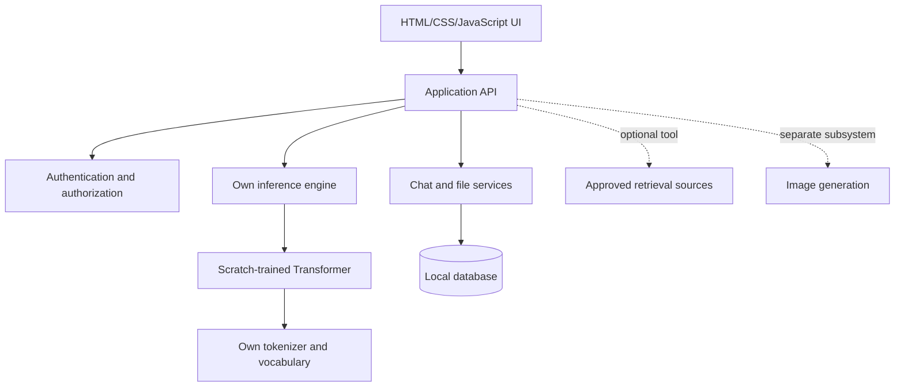

# Scratch LLM Architecture

## Product boundary

This project is a self-hosted AI platform whose language model is trained from
random initialization. It does not use Ollama, hosted AI APIs, or pretrained
language-model weights as the core system.

PyTorch is an implementation tool for tensor kernels, automatic
differentiation, CUDA execution, and serialization. It is not the model.

## System layers



The language model is not the database, search engine, file store, or image
generator. Those components provide context or capabilities around the model.

## Planned repository layout

```text
data/                 datasets and generated token data
docs/                 architecture, experiments, and model documentation
experiments/          small measured learning experiments
src/scratchllm/
  tokenizer/          vocabulary construction and encode/decode
  data/               dataset readers and batching
  model/              embeddings, attention, blocks, and language head
  training/           losses, optimizer, schedules, checkpoints, evaluation
  inference/          loading, sampling, and streaming generation
  api/                HTTP and WebSocket application boundary
web/                  initial browser client
tests/                unit and behavior tests
checkpoints/          ignored model checkpoints
```

## Hardware gates

The RTX 3050 6 GB is appropriate for correctness experiments and small
models. The current 50M target uses width 512 and 16 Transformer layers;
model size will be increased only after recording VRAM, RAM, tokens per
second, loss, and checkpoint size. A 300M pretraining run is not assumed to
fit; optimizer state and activations must be measured before attempting it.

Image generation is a separate project track and will not be inferred from
the language-model parameter count.
